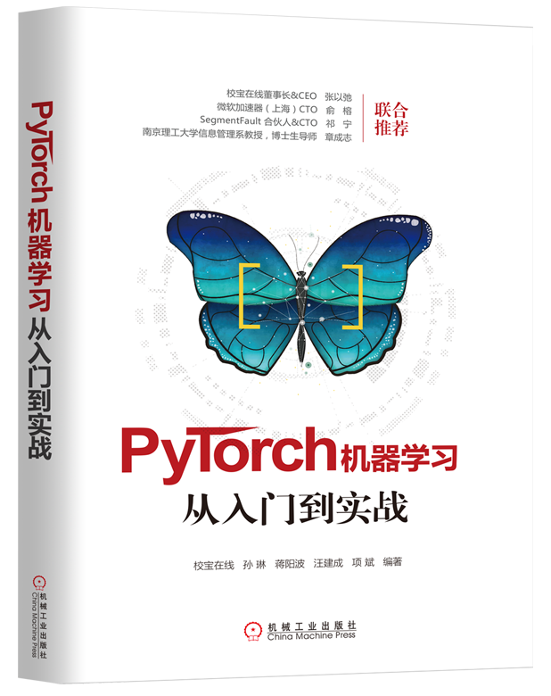

# 《PyTorch机器学习从入门到实战》





## 内容简介

该repository是《PyTorch机器学习从入门到实战》书里对应的示例代码。

购书链接：
[机械工业出版社](http://www.cmpbook.com/stackroom.php?id=44729)|
[亚马逊](https://www.amazon.cn/dp/B07JRBZJ9M/ref=sr_1_7?ie=UTF8&qid=1540979335&sr=8-7&keywords=PyTorch%E6%9C%BA%E5%99%A8%E5%AD%A6%E4%B9%A0)|
[china-pub](http://product.china-pub.com/8053408)|
[当当](http://search.dangdang.com/?key=PyTorch%BB%FA%C6%F7%D1%A7%CF%B0%B4%D3%C8%EB%C3%C5%B5%BD%CA%B5%D5%BD&act=input)|
[京东](https://search.jd.com/Search?keyword=PyTorch%E6%9C%BA%E5%99%A8%E5%AD%A6%E4%B9%A0%E4%BB%8E%E5%85%A5%E9%97%A8%E5%88%B0%E5%AE%9E%E6%88%98&enc=utf-8&wq=PyTorch%E6%9C%BA%E5%99%A8%E5%AD%A6%E4%B9%A0%E4%BB%8E%E5%85%A5%E9%97%A8%E5%88%B0%E5%AE%9E%E6%88%98&pvid=0265a6a4990c4bc58fd670c8d5f63aac)


近年来，基于深度学习的人工智能掀起了一股学习的热潮。本书是使用PyTorch深度学习框架的入门书籍。本书从深度学习原理入手，由浅入深，阐述深度学习中神经网络、深度神经网络、卷积神经网络、自编码器、循环神经网络等，同时穿插学习PyTorch框架的各个知识点和基于知识点的实例。最后，综合运用PyTorch和深度学习知识，来解决实践中的具体问题，比如图像识别、文本分类和命令词识别等。可以说，本书是深度学习和PyTorch的入门教程，同时也引领读者登堂入室，进入机会和挑战的人工智能领域。

本书针对的对象是机器学习和人工智能的爱好者和研究者，希望其能够有一定的机器学习和深度学习知识，有一定的Python编程基础。
## 目录

```
第 1 章 深度学习介绍
    1.1 人工智能、机器学习与深度学习
    1.2 深度学习工具介绍
    1.3 PyTorch 介绍
    1.4 你能从本书中学到什么
第 2 章 PyTorch 安装和快速上手
    2.1 PyTorch 安装
    2.2 Jupyter Notebook 使用
    2.3 NumPy 基础知识
    2.4 PyTorch 基础知识
第 3 章 神经网络
    3.1 神经元与神经网络
    3.2 激活函数
    3.3 前向算法
    3.4 损失函数
    3.5 反向传播算法
    3.6 数据的准备
    3.7 PyTorch 实例：单层神经网络实现
第 4 章 深度神经网络及训练
    4.1 深度神经网络
    4.2 梯度下降
    4.3 优化器
    4.4 正则化
    4.5 PyTorch 实例：深度神经网络实现
第 5 章 卷积神经网络
    5.1 计算机视觉
    5.2 卷积神经网络
    5.3 MNIST 数据集上卷积神经网络的实现
第 6 章 嵌入与表征学习
    6.1 PCA
    6.2 自编码器
    6.3 词嵌入
第 7 章 序列预测模型
    7.1 序列数据处理
    7.2 循环神经网络
    7.3 LSTM 和 GRU
    7.4 LSTM 在自然语言处理中的应用
    7.5 序列到序列网络
    7.6 PyTorch 实例：基于 GRU 和 Attention 的机器翻译
第 8 章 PyTorch 项目实战
    8.1 图像识别和迁移学习——猫狗大战
    8.2 文本分类
    8.3 语音识别系统介绍
```

## 运行环境
- python==3.6.5
- pytorch==0.3.0
- torch==0.3.0
- torchtext==0.2.1
- torchvision==0.2.0
- librosa==0.5.1
